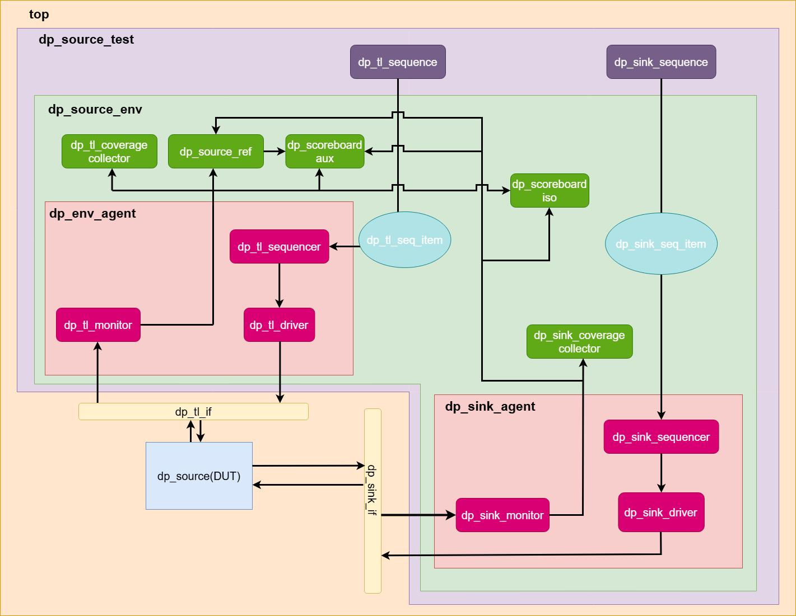

# DisplayPort (v2.1) Link Layer Source Verification

  <h3>Submitted to: Dr. Abdel Rahman Abo Taleb and Eng. Nour ElDeen ElHout</h3>
  <h4>By: Amira Atef, Aya El Desouky and Mohamed Ayman</h4>

***Notes***
- Basic testing is finished.
- Working on integrating the reference model class and including more elaborate test scenarios.
- Starting to document our work.
- Working on SVAs, Scoreboard and coverage.

**Table of Contents**
1. [**Signals Definition**](#signals-definition)
2. [**DP Source Link Layer Operation**](#dp-source-link-layer-operation)
3. [**Verification Environment Architecture**](#verification-environment-architecture)
4. [**Operation Wave Diagrams**](#operation-wave-diagrams)
5. [**Testing Scenarios - Basic, Complex and Advanced/Negative**](#testing-scenarios---basic-complex-and-advancednegative)
6. [**Verification Environment Issues and Solutions**](#verification-environment-issues-and-solutions)
7. [**QuestaSim Waveforms and Discovered Bugs**](#questasim-waveforms-and-discovered-bugs)
8. [**Code Coverage Report**](#code-coverage-report)
9. [Statement Coverage](#statement-coverage)
10. [Branch Coverage](#branch-coverage)
11. [Toggle Coverage](#toggle-coverage)
12. [**Functional Coverage Report**](#functional-coverage-report)
13. [**Assertions and Cover Directives**](#assertions-and-cover-directives)

#### **Signals Definition**
| Name      | Direction | Length | Interface | Description |
| --------  | --------  | ------ | ------    | ------ |
| clk_AUX       | input     | 1 bit  |-          | 100 KHz Clock   |
| clk_RBR       | input     | 1 bit  |-          | 162MHz Clock  |
| clk_HBR       | input     | 1 bit  |-          | 270MHz Clock  |
| clk_HBR2       | input     | 1 bit  |-         | 540MHz Clock  |
| clk_HBR3       | input     | 1 bit  |-         | 810MHz Clock  |
| MS_Stm_CLK       | input     | 1 bit  |-          | Clock with variable frequency  |
| rst_n     | input     | 1 bit  |-          | Active low async. reset|
| MS_rst_n     | input     | 1 bit  |TL          | Active low async. main stream reset|
| SPM_Transaction_VLD       | input     | 1 bit |TL     |  Active high valid signal for I2C request transactions. |
| SPM_Data  | input     | 8 bits  |TL     | Data to be written through I2C write request transaction. |
| SPM_Address         | input     | 20 bits |TL     | Register address to be written to or read from when requesting an I2C transaction. |
| SPM_LEN         | input     | 8 bits |TL     | Length of burst I2C transaction in bytes (0 value means 1 byte). |
| SPM_CMD       | input     | 2 bits  |TL     |  The command to specify the I2C transaction type (Read or Write). |
| LPM_Transaction_VLD       | input     | 1 bit |TL     |  Active high valid signal for Native AUX request transactions. |
| LPM_Data  | input     | 8 bits  |TL     | Data to be written through Native AUX write request transaction. |
| LPM_Address         | input     | 20 bits |TL     | Register address to be written to or read from when requesting an Native AUX transaction. |
| LPM_LEN         | input     | 8 bits |TL     | Length of burst Native AUX transaction in bytes (0 value means 1 byte). |
| LPM_CMD       | input     | 2 bits  |TL     |  The command to specify the Native AUX transaction type (Read or Write). |
| LPM_Start_CR      | input     | 1 bit |TL     |(Active high) Start link training by asserting this signal, marking the beginning of the Clock Recovery phase.|
| Config_Param_VLD       | input     | 1 bit |TL     |(Active high) Flag signal asserted indicating the arrival of Link BW, Lane Count, Max VTG, Max PRE, and EQ_RD_Value for the CR.|
| LPM_Link_BW       | input     | 8 bits |TL     |Maximum bandwidth that the sink can support, based on its capabilities.|
| LPM_Link_LC       | input     | 2 bits |TL     |The maximum number of lanes that the sink can support, based on its capabilities.|
| MAX_VTG       | input     | 2 bits |TL     |Maximum level of voltage swing supported by the sink capability.(Level 2 or 3)|
| MAX_PRE       | input     | 2 bits |TL     |Maximum level of pre-emphasis supported by the sink capability (Level 2 or 3)|
| Driving_Param_VLD       | input     | 1 bit |TL     |(Active high) Flag signal asserted indicating the arrival of voltage swing and pre-emphasis data.|
| VTG       | input     | 8 bits |TL     |  The voltage swing level. |
| PRE       | input     | 8 bits |TL     |  The pre-emphasis level. |
| CR_Done_VLD       | input     | 1 bit |TL     |  Active high valid signal for the CR_Done bus. |
| CR_Done       | input     | 4 bits |TL     |Indicates whether CR has been completed for the four lanes.|
| TPS_VLD       | input     | 1 bit |TL     |Active high valid signal for the TPS bus.|
| TPS       | input     | 2 bits |TL     |This signal indicates the maximum supported TPS Pattern Sequence.|
| EQ_RD_Value       | input     | 8 bits |TL     |This signal indicates the time the source waits during the EQ phase before checking the status update registers.|
| EQ_Data_VLD       | input     | 1 bit |TL     |Active high valid signal for the arrival of Channel_EQ, Symbol_Lock and Lane_Align.|
| Channel_EQ       | input     | 4 bits |TL     |Indicates whether EQ has been completed for the four lanes.|
| Symbol_Lock       | input     | 4 bits |TL     |Indicates whether Symbol Locking has been completed for the four lanes.|
| Lane_Align       | input     | 8 bits |TL     |Indicates whether lane alignment has been completed.|
| EQ_CR_DN       | input     | 4 bits |TL     |Indicates whether CR has been completed for the four lanes, during EQ Stage.|
| SPM_ISO_start       | input     | 1 bit |TL     |Marks the beginning of a new video transmission to indicate that the main video stream is valid and should be processed. When de-asserted, it signifies either the end of the video stream or an error that requires stopping stream data transmission.|
| SPM_Lane_Count       | input     | 3 bits |TL     |Represents the number of lanes that will be used for the stream transmission.|
| SPM_Lane_BW       | input     | 3 bits |TL     |Represents the bandwidth of a single lane for stream transmission after LT. The 16-bit value is multiplied by 0.27 to determine the lane bandwidth (e.g., 1.62 Gbps, 2.7 Gbps).|
| SPM_MSA_VLD       | input     | 1 bit |TL     |Valid signal for the MSA data.|
| SPM_Full_MSA       | input     | 192 bits |TL     |Defines the Main Stream Attributes (MSA).|
| SPM_BW_Sel       | input     | 2 bits |TL     | The selection line for the PLL-generated clock, it selects the proper clock based on the lane BW after LT.|
| MS_Pixel_Data       | input     | 48 bits |TL     |  Representing the pixel values for the transmitted frame.|
| MS_DE       | input     | 1 bit |TL     |  Indicates the active period of the stream when HIGH and the blanking period when LOW.|
| MS_Stm_BW_VLD       | input     | 1 bit |TL     |  Valid signal for MS_Stm_BW.|
| MS_Stm_BW       | input     | 10 bits |TL     |  Indicates the BW of the stream source (e.g, 60 MHz, 80 MHz, etc.)|
| MS_VSYNC       | input     | 1 bit |TL     |   Asserted to indicate the start of the VBlank period and is activated after the front porch phase at its beginning.|
| MS_HSYNC       | input     | 1 bit |TL     |  Asserted to indicate the start of the HBlank period and is activated after the front porch phase at its beginning.|
| SPM_Native_I2C | output    | 1 bit  |TL     |  Active high valid signal for I2C reply transactions. |
| SPM_Reply_ACK_VLD       | output    | 1 bit |TL     |  Valid signal for the I2C reply transaction status. |
| SPM_Reply_ACK     | output    | 2 bits  |TL     | I2C reply transaction status; may be ACK, NACK or DEFER. |
| SPM_Reply_Data_VLD      | output    | 1 bit  |TL    |  Valid signal for the I2C read reply transaction data. |
| SPM_Reply_Data      | output    | 8 bits  |TL    |  I2C read reply transaction data. |
| CTRL_I2C_Failed      | output    | 1 bit  |TL    |  This signal is asserted if the I2C Reply transaction failed. |
| LPM_Native_I2C | output    | 1 bit  |TL     |  Active low valid signal for Native AUX reply transactions. |
| LPM_Reply_ACK_VLD       | output    | 1 bit |TL     |  Valid signal for the Native AUX reply transaction status. |
| LPM_Reply_ACK     | output    | 2 bits  |TL     | Native AUX reply transaction status; may be ACK, NACK or DEFER. |
| LPM_Reply_Data_VLD      | output    | 1 bit  |TL    |  Valid signal for the Native AUX read reply transaction data. |
| LPM_Reply_Data      | output    | 8 bits  |TL    |  Native AUX read reply transaction data. |
| CTRL_Native_Failed      | output    | 1 bit  |TL    | This signal is asserted if the Native Reply transaction failed.|
| Timer_Timeout      | output    | 1 bit  |TL    | This signal is asserted if the DP Source timed-out while waiting for a reply transaction from the DP Sink.|
| HPD_Detect      | output    | 1 bit  |TL    | This signal indicates that a sink device has been successfully connected.|
| HPD_IRQ      | output    | 1 bit  |TL    | This signal indicates an interrupt request from the sink.|
| CR_Completed      | output    | 1 bit  |TL    | This signal is asserted once the CR Phase has successfully completed.|
| FSM_CR_Failed      | output    | 1 bit  |TL    | This signal is asserted when the CR Phase has failed.|
| EQ_LT_Pass      | output    | 1 bit  |TL    | This signal is asserted once the EQ Phase has successfully completed, indicating successful link training.|
| EQ_LT_Failed      | output    | 1 bit  |TL    | This signal is asserted when the EQ Phase has failed.|
| EQ_FSM_CR_Failed      | output    | 1 bit  |TL    | Signal indicating the failure of the CR phase during EQ phase of link training. |
| EQ_Final_ADJ_BW      | output    | 8 bits  |TL    | The adjusted link BW after successful LT used for sending main video stream.|
| EQ_Final_ADJ_LC      | output    | 2 bits  |TL    | The adjusted lane count after successful LT used for sending main video stream.|
| Wfull      | output    | 1 bit  |TL    |  Asserted when the internal FIFO becomes full while the stream source is actively sending pixels. It indicates that a pixel overflow is imminent.|
| HPD_Signal      | input    | 1 bit  |PL    | Indicates the connection status based on its duration. Status may be a IRQ_HPD event, Hot Unplug event or a Hot Plug/Re-plug event.|
| PHY_START_STOP      | input    | 1 bit  |PL    | Indicates the beginning and end of the reply transaction.|
| AUX_IN_OUT      | inout    | 8 bits  |PL    | A request/reply transaction where each byte is transmitted or received byte-by-byte.|
| AUX_START_STOP      | output    | 1 bit  |PL    | Indicates the beginning and end of the request transaction.|
| PHY_Instruct_VLD      | output    | 1 bit  |PL    | Active high valid signal for the PHY_Instruct bus.|
| PHY_Instruct      | output    | 2 bits  |PL    | Instructs the PHY layer to begin sending a specific training pattern sequence (TPS1, 2, 3, 4).|
| PHY_ADJ_BW      | output    | 8 bits  |PL    | Adjusted BW after successful LT.|
| PHY_ADJ_LC      | output    | 2 bits  |PL    | Adjusted lane count after successful LT.|
| ISO_symbols_lanex      | output    | 8 bits  |PL    | Carry the processed main video stream data and control symbols.|
| Control_sym_flag_lanex      | output    | 1 bit  |PL    | Asserted when the block outputs control symbols.|
___

#### **DP Source Link Layer Operation**

___

#### **Verification Environment Architecture**
 |
|:--:|
| *Figure 2: Verification Architecture for DP Link Layer Source* |
___

#### **Operation Wave Diagrams**

___

#### **Testing Scenarios - Basic, Complex and Advanced/Negative**

___

#### **Verification Environment Issues and Solutions**

___

#### **QuestaSim Waveforms and Discovered Bugs**

___

####  **Code Coverage Report**
#### Statement Coverage

#### Branch Coverage

#### Toggle Coverage

___
####  **Functional Coverage Report**

___
#### **Assertions and Cover Directives**

___